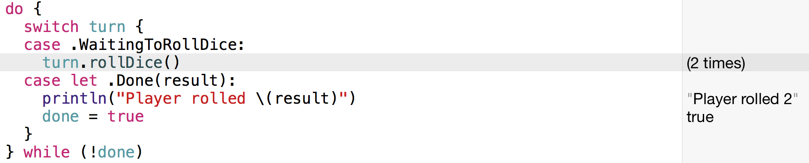

---
title: "Learn Swift by example - Part 2: Enums"
slug: enums-in-swift
---     

In [part 1 of this tutorial series](https://www.makeschool.com/tutorials/learn-swift-by-example-part-1-structs/structs-in-swift) we have discussed the power of structs in Swift (if you have missed it, you should go read it now). We have seen that they often can be used instead of classes and that they can increase the maintainability of your code. Structs are *value types* and are copied on assignment, every receiver has its own private copy that can be safely read and modified.

Today we are going to discuss a second very useful value type - `enum`. Very similar to structs, enums in Swift are a *lot* more powerful than in Objective-C.

We will start this article by taking a look how enums work in Objective-C. Then we'll move to Swift, first looking at basics use cases, then we will dive into some exciting examples of leveraging enums in Swift.

##Enums in Objetive-C

Enums in Objetive-C are pretty simple, here's an example:

    typedef NS_ENUM(NSInteger, UserType) {
        UserTypeRegular,
        UserTypeVIP,
        UserTypeAdmin
    }; 

We could use this enum to model the role of a user in an application:

    user.type = UserTypeRegular
    
This is a typical use case for an enum in Objetive-C (or pure C). Behind the scenes each of the enum entries an is mapped to an integer value (starting with 0 for the first entry). In Objective-C the above line would be equivalent to this one:

    user.type = 0
    
And that's about how much you can do with enums in Objective-C: give integer constants meaningful names. 

##Enums in Swift: Basics
 
The use case we outlined just now, modeling different user types, works pretty much the same in Swift:

    enum UserType {
      case Regular
      case VIP
      case Admin
    }

    class User {
      var type: UserType?
    }

    var user = User()

    user.type = UserType.Admin
    
In the simplest case enums can be used similar as in Objective-C. There are two interesting details about the Swift enum.

The first is how the enum values are namespaced. We can call the value `Regular` instead of `UserTypeRegular`. Swift automatically namespaces the member values with the name of the enum (`UserType.Regular`) while enum values in Objective-C exist in the global namespace (`UserTypeRegular`). This namespacing also allows the following short-form:

    user.type = .Admin
    
Because the compiler knows that `user.type` is declared as `UserType` we can use the name of the member value without the name of the enum.

The second interesting difference is that in Swift enum values are not mapped to integers. The type of the enum values is `UserType` and not `Int`. If you need the old Objective-C behavior, in which all members are mapped to an integer you can use enums with *Raw values* in Swift.
###Raw values 

Using raw values you can assign a value to every enum member when declaring the enum:

    enum UserType: Int {
      case Regular = 0
      case VIP = 1
      case Admin = 2
    }

To create an enum with raw values you need to declare the type after the enum name. Additionally you need to assign values of that type to each enum member. Integers are the only exception, when you don't assign explicit values Swift will automatically assign values from 0 to n:

    enum UserType: Int {
      case Regular
      case VIP
      case Admin
    }

You can access the raw value of each entry through the `rawValue` property:

    UserType.Admin.rawValue // == 2
    
Similarly you can create an enum member from a raw value:

    var userType = UserType(rawValue: 2) // == .Admin 
    
Raw values are not limited to integers. You can also use strings, characters, or floating-point numbers. If you aren't using integers you will have to explicitly assign a value to every enum member.
    
So far, so basic. I have showed you that enums in Swift can be used very similarly to enums in Objective-C. Now it's time to dive into some advanced features!

##Enums in Swift: Advanced Features

Enums in Swift have a bunch of features they didn't have in Objective-C. Enums can have initializers, methods, computed properties and they can even conform to protocols! We're going to start by exploring another feature, called *Associated Values* because I believe it is the most important enum feature in Swift.

###Associated Values
In Objetive-C we could already associate values with enum members by storing an integer value for each enum entry, as shown at the beginning of this tutorial. So what is new about this?

Firstly, associated values allow each enum member to store data of a any type. One enum member can store a string while another member stores an integer, etc. In Objective-C and when working with raw value enums in Swift, all members need to have the same type (e.g. integer).

Secondly, associated values are assigned when the enum value is *created*, not when the enum is declared. In the young history of the Swift language this feature has most commonly been used to model the return result of functions. Let's dive into a larger example to explain associated values. 

We want to model a bank account. The bank account has a cash amount associated with it. It also has a method to withdraw money. If the withdrawal amount is larger than the cash amount, the transaction fails and we want to return an error message to the caller. If there's enough cash in the account, the money get's withdrawn and we want to return the new balance to the caller. Depending on success or failure of the transaction we want to return a value with a different type.

It turns out that this can be modeled very nicely with an enum that has associated values:

    enum WithdrawalResult {
      case Success(Int)
      case Error(String)
    } 

As you can see in this example, each enum member can have its own associated type. We model each of the possible outcomes as one enum member. 

Next, let's set up the bank account with the cash balance and a withdrawal function:

    struct BankAccount {
      var cash = 100
      
      mutating func withdraw(amount:Int) -> WithdrawalResult {
        if (amount <= cash) {
          cash -= amount
          return .Success(cash)
        } else {
          return .Error("Not enough money!")
        }
      }
    }

The withdrawal function takes an amount to withdraw and returns a value of type `WithdrawalResult`. This `WithdrawalResult` can either be a `.Success` case or an `.Error` case. The function checks if the funds are sufficient. If there's enough cash in the account, the requested amount gets withdrawn and a `.Success` case is returned. As you can see in this example, each enum member that has an associated value needs to be initialized with a value of the correct type - a success case needs to be created with an `Int` that describes the remaining account balance.

If the funds are insufficient we return an `.Error` case. The error case needs to be initialized with a `String` that describes the error message.

To wrap this example up, let's take a look at how we can call this method and consume the return value:

    var bankAccount = BankAccount()
    let result = bankAccount.withdraw(99)

    switch result {
    case let .Success(newBalance):
      println("Your new balance is \(newBalance)")
    case let .Error(message):
      println(message)
    }

First we create a bank account. By default this account has a balance of 100 money units. Then we withdraw 99 money units and store the `Withdrawal` result.

A great way to work with this return result is using a switch statement. We can create a `case` and perform a different action for each possible enum member. Using the `let` or the `var` keyword we can also access the associated value of an enum member. You should also note that switch statements in Swift do not require the `break` keyword at the end of each case.

In the success case we create an immutable variable `newBalance` that holds the new balance returned from a successful withdrawal. We then use this balance to print a message that tells to user how much money is left in the bank account.

In the error case we bind the error message to a local variable called `message` and print it.

For me personally this has been one of the most useful ways to use enums! If you have a function that needs to model multiple different return values you should consider this solution.

### Initializers and functions

Enums can also have initializers and even functions. I want to show you second example to give you an idea for what you could use these features.

Let's assume we want to model a player's turn in a  dice based game. The only rule of the game is that the player needs to roll a dice until she gets a value that is *not* 6. If the player dices a 6 she needs to repeat the dice roll. 

We can model this turn with an enum. Most cases in which you would actually use an enum are more complicated than this one, but I want to show you the functionality with an example that is not too extensive. This is what the basic enum should look like:

    enum PlayerTurn {
      case WaitingToRollDice
      case Done(Int)
      
      init () {
        self = .WaitingToRollDice
      }
    }
    
The turn can be in two different states, waiting for a dice roll or having completed a dice roll. In the completed case we want to remember the result value. 

The initializer in this example is pretty simple. When a new `PlayerTurn` is created it's always in the `.WaitingToRollDice` state.

Next, we need to add a function that performs a dice roll. Add this function to the enum:

    mutating func rollDice() -> Int {
        let diceResult = Int(arc4random_uniform(6) + 1)
        if (diceResult < 6) {
         self = .Done(diceResult)
        }
        return diceResult
    }
     
The first important thing to notice, is that this function is marked as `mutating`. Depending on the result of the dice roll we will change the enum value from `.WaitingToRollDice` to `.Done` - that is a mutation (change) of the enum value and requires the `mutating` keyword. The function doesn't take any parameters and it returns an `Int` (the result of the dice roll). 

Inside of the function we generate a random number between 1 and 6. We switch to the `.Done` state, only if the dice result is smaller than 6. Otherwise we remain in the same state. That's all we need for modeling the `PlayerTurn`!

Now all that remains is writing the code that uses this player turn model:

    var turn = PlayerTurn()
    var done = false

    do {
      switch turn {
      case .WaitingToRollDice:
        turn.rollDice()
      case let .Done(result):
        println("Player rolled \(result)")
        done = true
      }
    } while (!done)
    
First we create a player turn and a loop variable. We need the `done` variable because as of Swift 1.2 there's no way to perform the following check:

     turn == PlayerTurn.Done
     
When using enums with associated values we can only use switch statements to perform checks. That's why we need the additional boolean value to control wether the loop should continue or not.

The code inside of the loop is pretty straightforward. We check for the two possible cases. If the player turn has a value `.WaitingToRollDice`, we call the `rollDice()` function. If the value is `.Done` we print the result of the dice roll and terminate the loop by setting `done` to `true`.

If you run this code often enough (by making small changes in the playground file) you should get lucky and see case in which the dice is actually rolled twice:

Playground will indicate this by showing how many times a certain line has been executed.

With this example we have built a very simple [state machine](http://en.wikipedia.org/wiki/Finite-state_machine).

##Conclusion

Enums are very powerful in Swift! We can associate values with enum members and use them to model functions with multiple return results. As shown in the bank account example, this can be very useful for error handling. 

We can also use enums to build state machines. Enums are guaranteed to only store one of their possible values at any point in time, this guarantee can be used to write more predictable code.

The possibilities don't end here, I'm very excited to see how enums will be used to write better Swift code.

If you want to learn more about Swift and ship your own original iPhone App or iPhone Game you should attend our [Summer Academy](https://makeschool.com/apply?referrer=54750)!

Stay tuned for more tutorials of this series!

##Related Resources

- A great talk by [Austin Zheng](https://twitter.com/austinzheng) about [enums and pattern matching in Swift](http://realm.io/news/swift-enums-pattern-matching-generics/)
